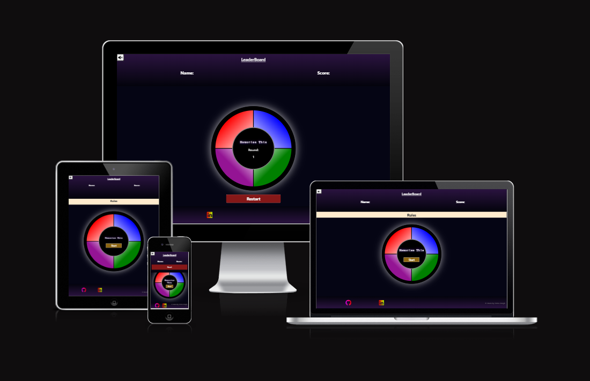

# [memorise-this](https://twitch10126.github.io/memorise-this)

Developer: Emma Bough ([twitch10126](https://www.github.com/twitch10126))

**Overview**

"Memorise This" is an interactive memory game designed to test the players skills and quick reflexes. The game presents users with an increasingly complex sequence of colors and sounds that they must recall and repeat. As players progress, the difficulty increases, requiring more focus and stronger memorization abilities. It is designed to increase in difficulty, so players of all levels can participate whether they are beginners looking for a little entertainment or experienced players looking for a mental workout.

**Site Mockups**

source: [memorise-this amiresponsive](https://ui.dev/amiresponsive?url=https://twitch10126.github.io/memorise-this)

## UX

### The 5 Planes of UX

#### 1. Strategy

**Purpose**

- Provide users with a fun and accessible way to improve cognitive function.
- Deliver instant feedback to improve usability.
- Support accessibility and user-friendly interactions.

**Primary User Needs**

- Recall correct patterns to progress through the game.
- Increase difficulty gradually for a gradual learning curve
- Track performance to motivate self-improvement.

**Business Goals**

- Encourage users to engage with the app for fun and educational purposes.
- Showcase a well-designed, accessible tool that supports learning.
- Create an engaging and rewarding experience that encourages repeated play.

#### 2. Scope

**[Features](#features)** (see below)

**Content Requirements**

- Clear labels and instructions for game buttons (e.g., "Start", "rules", "leaderboard").
- Visual and audio cues for correct/incorrect inputs.
- Progress tracking to display scores.

#### 3. Structure

**Information Architecture**

- **Header Area**:
- Mute button: Allows the user to toggle game sound on/off.
- Leaderboard: Displays users inputted name and score.

- **Main Interface**:
  - Rules Button: Provides quick access to the game rules before the game starts.
  - Game Area: The gameplay screen where sequences are presented and user interactions take place.
  - Feedback System: Success indicators after each successful sequence or Immediate alert on incorrect input.
  - Progress Tracking: Shows current round to motivate continued play.

**User Flow**

1. User opens the game → sees leaderboard and mute button in the header.
2. Reads rules (optional) → presses the "Start" button.
3. Game plays a pattern → user repeats it using the coloured game buttons.
4. User receives feedback (success or failure).
5. If successful → the next level begins with a longer pattern.
6. User tracks round through on screen indicator.
7. If incorrect → the game resets and a message appears with option to input your name and save score to the leaderboard.

#### 4. Skeleton

**[Wireframes](#wireframes)** (see below)

#### 5. Surface

**Visual Design Elements**

- **[Colours](#colour-scheme)** (see below)
- **[Typography](#typography)** (see below)
