# [memorise-this](https://twitch10126.github.io/memorise-this)

Developer: Emma Bough ([twitch10126](https://www.github.com/twitch10126))

**Overview**

"Memorise This" is an interactive memory game designed to test the players skills and quick reflexes. The game presents users with an increasingly complex sequence of colors and sounds that they must recall and repeat. As players progress, the difficulty increases, requiring more focus and stronger memorization abilities. It is designed to increase in difficulty, so players of all levels can participate whether they are beginners looking for a little entertainment or experienced players looking for a mental workout.

**Site Mockups**

source: [memorise-this amiresponsive](https://ui.dev/amiresponsive?url=https://twitch10126.github.io/memorise-this)

## UX

### The 5 Planes of UX

#### 1. Strategy

**Purpose**

- Provide users with a fun and accessible way to improve cognitive function.
- Deliver instant feedback to improve usability.
- Support accessibility and user-friendly interactions.

**Primary User Needs**

- Recall correct patterns to progress through the game.
- Increase difficulty gradually for a gradual learning curve
- Track performance to motivate self-improvement.

**Business Goals**

- Encourage users to engage with the app for fun and educational purposes.
- Showcase a well-designed, accessible tool that supports learning.
- Create an engaging and rewarding experience that encourages repeated play.

#### 2. Scope

**[Features](#features)** (see below)

**Content Requirements**

- Clear labels and instructions for game buttons (e.g., "Start", "rules", "leaderboard").
- Visual and audio cues for correct/incorrect inputs.
- Progress tracking to display scores.

#### 3. Structure

**Information Architecture**

- **Header Area**:
- Mute button: Allows the user to toggle game sound on/off.
- Leaderboard: Displays users inputted name and score.

- **Main Interface**:
  - Rules Button: Provides quick access to the game rules before the game starts.
  - Game Area: The gameplay screen where sequences are presented and user interactions take place.
  - Feedback System: Success indicators after each successful sequence or Immediate alert on incorrect input.
  - Progress Tracking: Shows current round to motivate continued play.

**User Flow**

1. User opens the game → sees leaderboard and mute button in the header.
2. Reads rules (optional) → presses the "Start" button.
3. Game plays a pattern → user repeats it using the coloured game buttons.
4. User receives feedback (success or failure).
5. If successful → the next level begins with a longer pattern.
6. User tracks round through on screen indicator.
7. If incorrect → the game resets and a message appears with option to input your name and save score to the leaderboard.

#### 4. Skeleton

**[Wireframes](#wireframes)** (see below)

#### 5. Surface

**Visual Design Elements**

- **[Colours](#colour-scheme)** (see below)
- **[Typography](#typography)** (see below)

### Colour Scheme

I used [coolors.co](https://coolors.co/050514-03030c-2a133f-808080-b8900d-ff0000-0000ff-941494-008000-ffebcd) to generate my color palette.

- `#050514` background-color.
- `#2a133f` gradient-color1.
- `#03030c` gradient-color2.
- `#808080` highlight.
- `#ff0000` button1.
- `#0000ff` button2.
- `#941494` button3.
- `#008000` button4.
- `#008000` gold-highlight.
- `#ffebcd` rules.

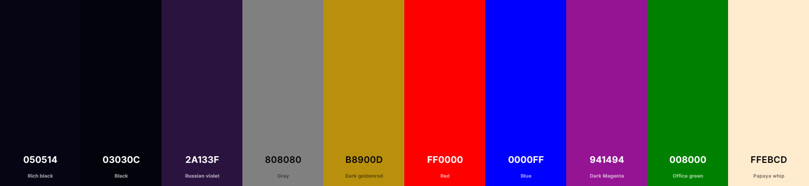

### Typography

- [Cutive Mono](https://fonts.google.com/specimen/Cutive+Mono) was used for the headings inside the game interface.
- [Lora](https://fonts.google.com/specimen/Lora) was used for the leaderboard and 404 titles.
- [Font Awesome](https://fontawesome.com) icons were used throughout the site, such as the mute button in the header and the social media icons in the footer.

## Wireframes

To follow best practice, wireframes were developed for mobile, tablet, and desktop sizes.
I've used [Balsamiq](https://balsamiq.com/wireframes) to design my site wireframes.

| Page | Mobile                                                 | Tablet                                                 | Desktop                                                 |
| ---- | ------------------------------------------------------ | ------------------------------------------------------ | ------------------------------------------------------- |
| Home | 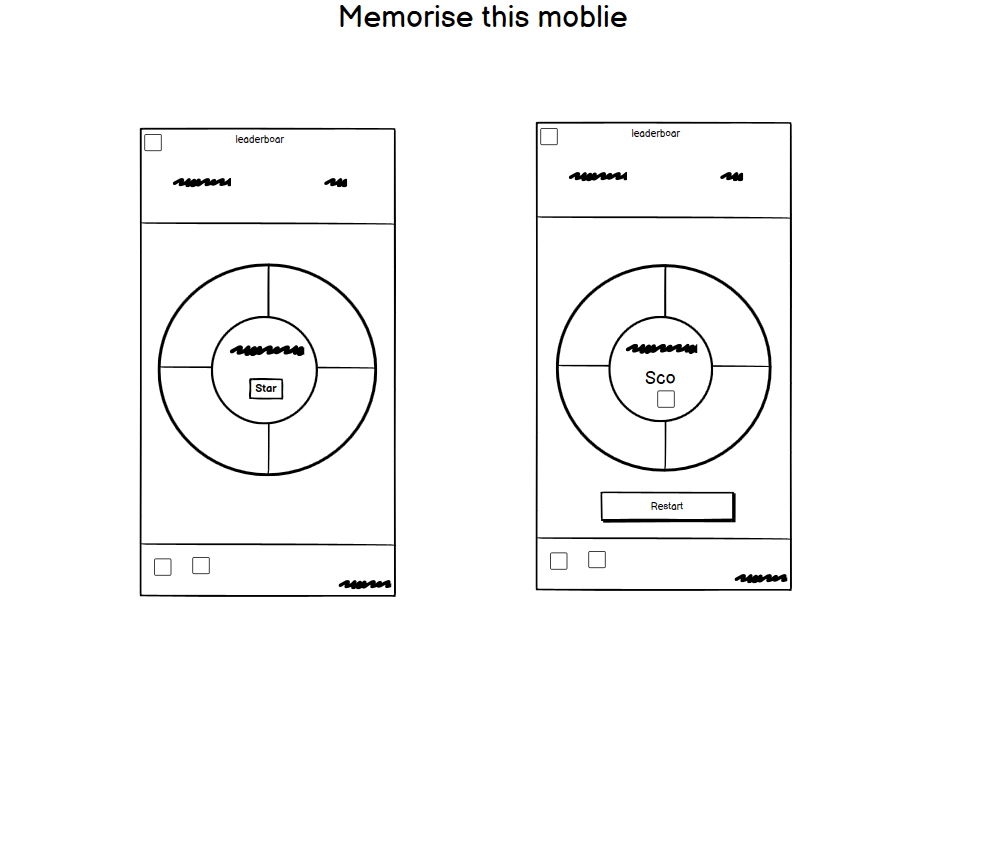     | 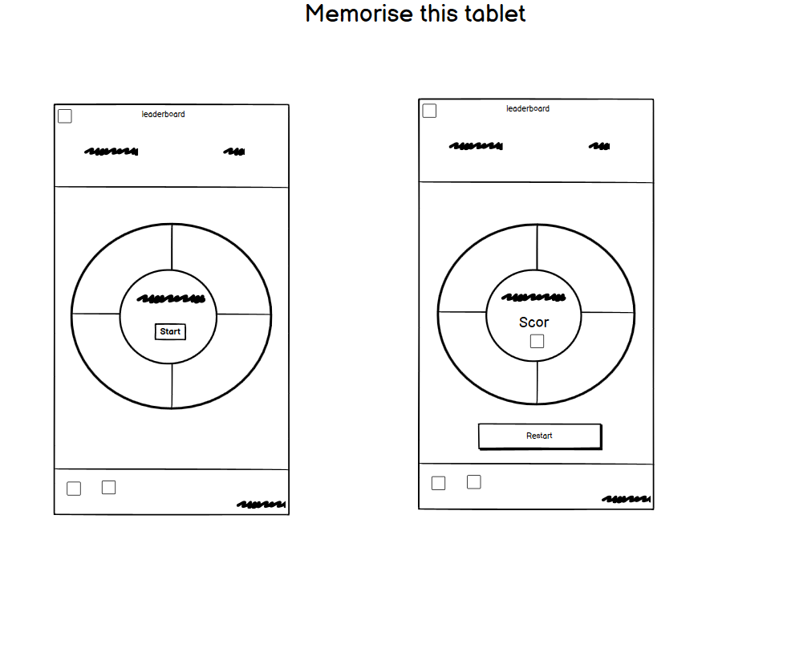     | 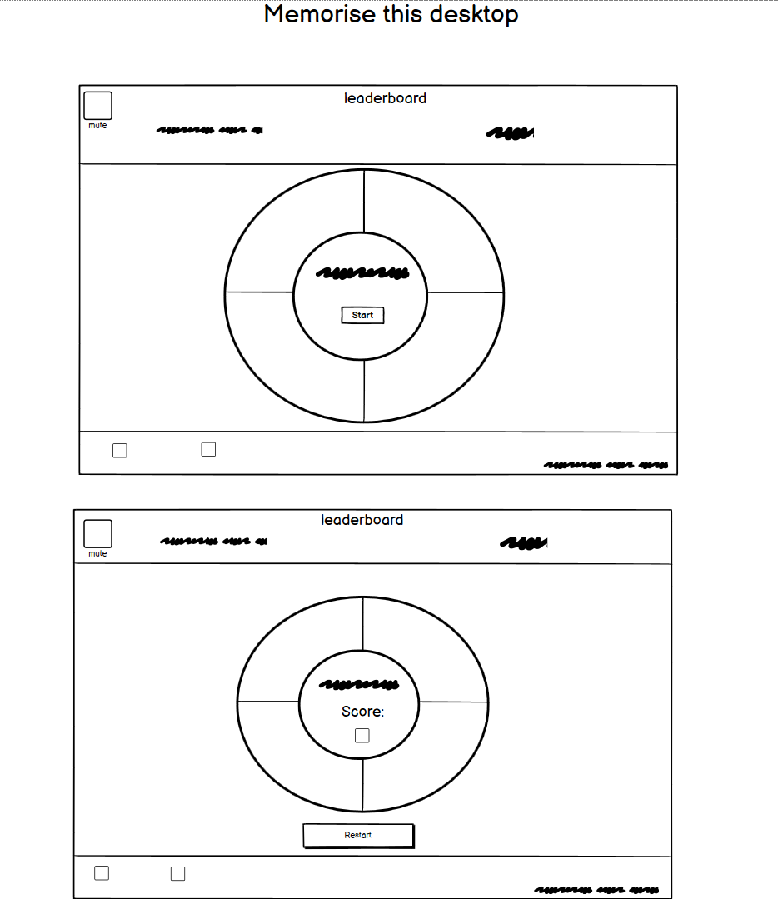     |
| 404  | 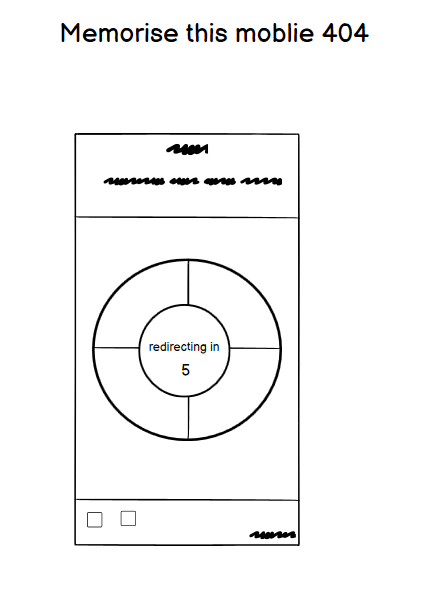 | 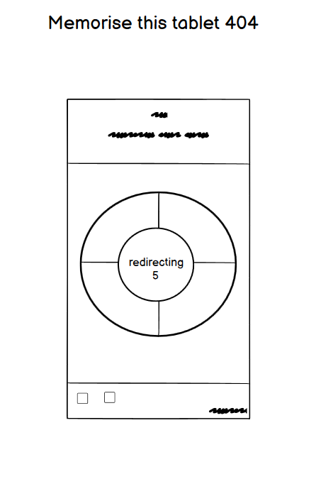 | 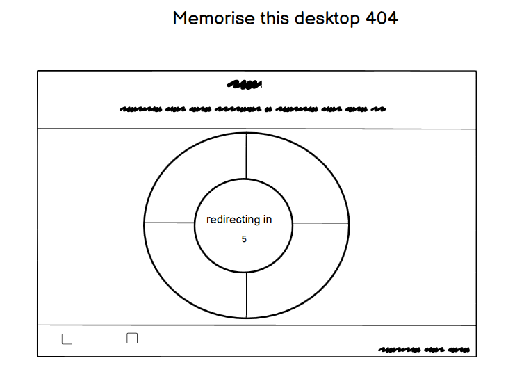 |

## User Stories

| Target      | Expectation                                                       | Outcome                                              |
| ----------- | ----------------------------------------------------------------- | ---------------------------------------------------- |
| As a player | I want to see a clear start button on the screen                  | so that I can begin the game.                        |
| As a player | I want to understand the rules of the game before starting        | so that I know how to play.                          |
| As a player | I want the game to display a sequence of coloured lights          | so that I can memorize and repeat it.                |
| As a player | I want to press the correct sequence of coloured buttons          | so that I can advance to the next round.             |
| As a player | I want the sequence to increase in difficulty as I progress       | so that the game remains challenging.                |
| As a player | I want the game to provide instant feedback when I press a button | so that I know if my input was correct or incorrect. |
| As a player | I want the game to show my score after each round                 | so that I can track my progress.                     |
| As a player | I want the option to restart the game after losing                | so that I can try again.                             |
| As a player | I want my highest score to be saved                               | so that I can challenge myself to beat it.           |

## Features

### Existing Features

| Feature            | Notes                                                                                                                                                                                                                                                                    | Screenshot                                               |
| ------------------ | ------------------------------------------------------------------------------------------------------------------------------------------------------------------------------------------------------------------------------------------------------------------------ | -------------------------------------------------------- |
| Coloured buttons   | The coloured buttons (`red`, `blue`, `green`, `purple`) are large and colorful to allow users to easily input the correct sequence set by the AI. Each coloured button has its own unique sound and flashes for easy identification.                                     | 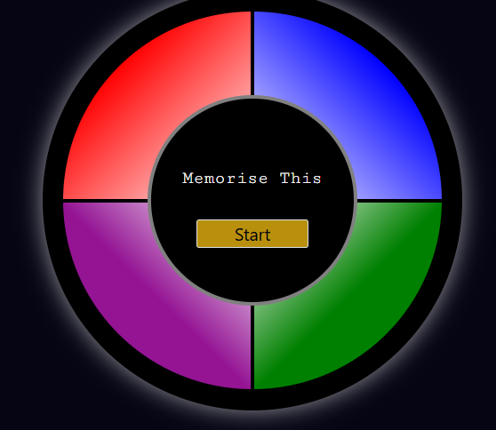 |
| Header/Leaderboard | This section visibly displays the mute button the players inputted name, score and reset button. The leaderboard displays only the top 10 scores and will only update if the score is greater than or equal to 1                                                         | 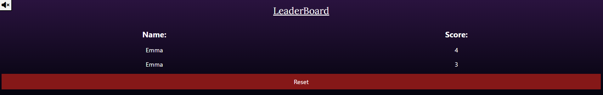    |
| Mute button        | This button allows users to toggle the game sound on and off. On page load the volume is muted by default.                                                                                                                                                               |     |
| Restart button     | The restart button resets the game to its initial state waiting for the user to start the next game.                                                                                                                                                                     | 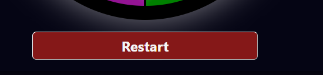        |
| Alert              | Once the user enters the wrong sequence, an alert pops up prompting the user to enter their name. This showcases if they got it correct, or if they've gotten it incorrect, therefore also showing the correct answer.                                                   | 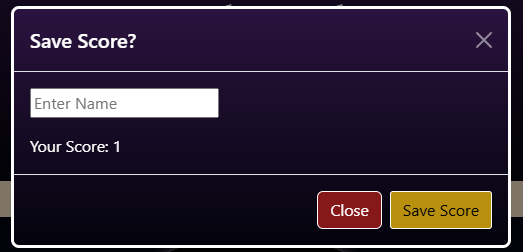          |
| 404                | The 404 error page will indicate when a user has somehow navigated to a page that doesn't exist. This replaces the default GitHub Pages 404 page, and ties-in with the look and feel of the _Memorise this_ site by using the standard navbar game interface and footer. | 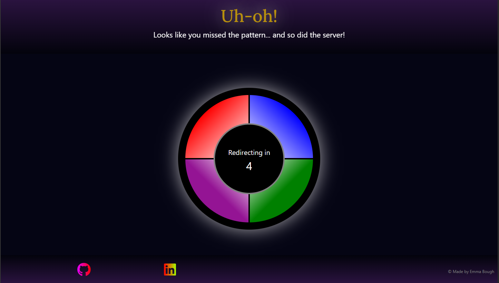            |

### Future Features

- **Level selection**: Add level selection options after a user has failed the sequence but has reached a set amount of levels (10, 15, 20) etc so they can continue from the level they lost.
- **Achievements**: Display achievements a user has collected from completing levels.
- **Multiplayer mode**: Add a multiplayer mode so player can also play with their friends.
- **Global leaderboard**: Add a global leaderboard so players can compete with players anywhere for a shot at getting your name on the global leaderboard.
- **Bonus games**: Add bonus games to allow users to collect collectables.

## Tools & Technologies

| Tool / Tech                                                                                                             | Use                                                                         |
| ----------------------------------------------------------------------------------------------------------------------- | --------------------------------------------------------------------------- |
|  | Generate README and TESTING templates.                                      |
|                         | Version control. (`git add`, `git commit`, `git push`)                      |
|                    | Secure online code storage.                                                 |
|           | Local IDE for development.                                                  |
|       | Main site content and layout.                                               |
|          | Design and layout.                                                          |
|    | User interaction on the site.                                               |
|                    | User interaction on the site.                                               |
|   | Hosting the deployed front-end site.                                        |
|        | Front-end CSS framework for modern responsiveness and pre-built components. |
|                         | Automated JavaScript testing.                                               |
|   | Creating wireframes.                                                        |
|    | Icons.                                                                      |
|              | Help debug, troubleshoot, and explain things.                               |
|       | Tutorials/Reference Guide                                                   |

## Agile Development Process

### GitHub Projects

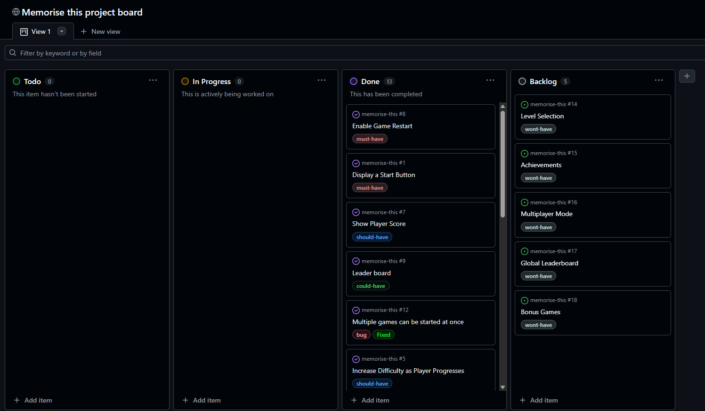

### GitHub Issues

[GitHub Issues](https://www.github.com/twitch10126/memorise-this/issues) served as an another Agile tool. There, I managed my User Stories and Milestone tasks, and tracked any issues/bugs.

| Link                                                                                                                                                                               | Screenshot                                            |
| ---------------------------------------------------------------------------------------------------------------------------------------------------------------------------------- | ----------------------------------------------------- |
|                                         | 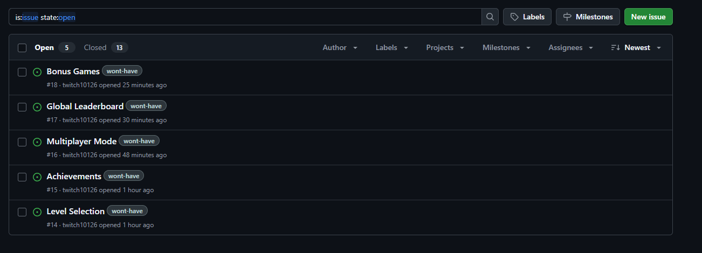   |
|  | 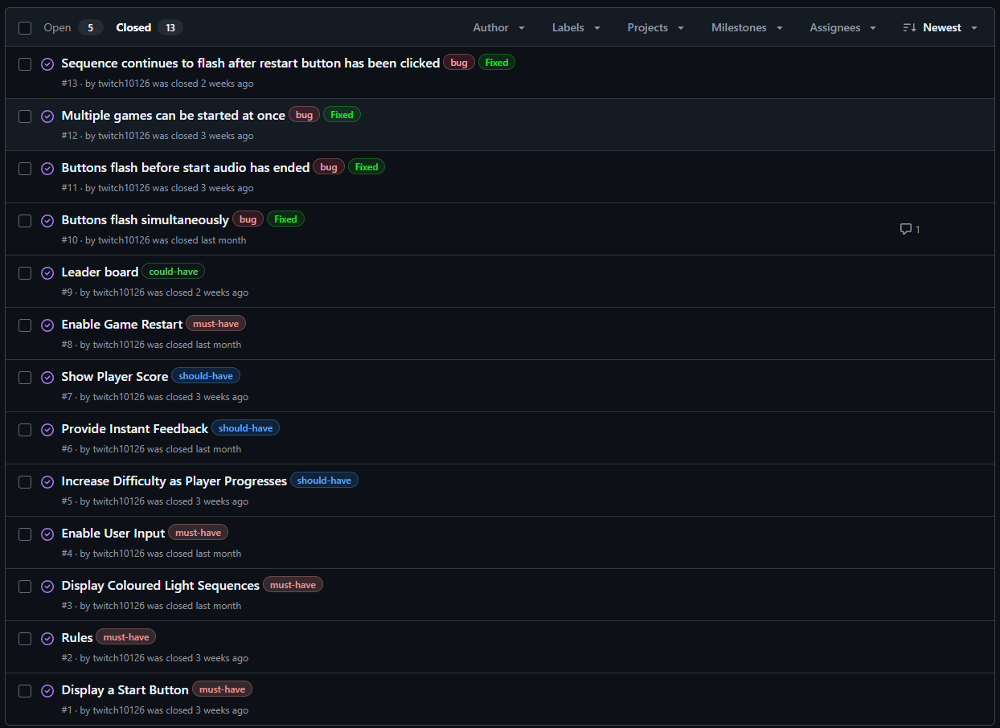 |

### MoSCoW Prioritization

I've decomposed my Epics into User Stories for prioritizing and implementing them. Using this approach, I was able to apply "MoSCoW" prioritization and labels to my User Stories within the Issues tab.

- **Must Have**: guaranteed to be delivered - required to Pass the project (_max ~60% of stories_)
- **Should Have**: adds significant value, but not vital (_~20% of stories_)
- **Could Have**: has small impact if left out (_the rest ~20% of stories_)
- **Won't Have**: not a priority for this iteration - future features

## Testing

> [!NOTE]
> For all testing, please refer to the [TESTING.md](TESTING.md) file.

## Deployment

### GitHub Pages

The site was deployed to GitHub Pages. The steps to deploy are as follows:

- In the [GitHub repository](https://www.github.com/twitch10126/memorise-this), navigate to the "Settings" tab.
- In Settings, click on the "Pages" link from the menu on the left.
- From the "Build and deployment" section, click the drop-down called "Branch", and select the **main** branch, then click "Save".
- The page will be automatically refreshed with a detailed message display to indicate the successful deployment.
- Allow up to 5 minutes for the site to fully deploy.

The live link can be found on [GitHub Pages](https://twitch10126.github.io/memorise-this).

### Local Development

This project can be cloned or forked in order to make a local copy on your own system.

#### Cloning

You can clone the repository by following these steps:

1. Go to the [GitHub repository](https://www.github.com/twitch10126/memorise-this).
2. Locate and click on the green "Code" button at the very top, above the commits and files.
3. Select whether you prefer to clone using "HTTPS", "SSH", or "GitHub CLI", and click the "copy" button to copy the URL to your clipboard.
4. Open "Git Bash" or "Terminal".
5. Change the current working directory to the location where you want the cloned directory.
6. In your IDE Terminal, type the following command to clone the repository:
   - `git clone https://www.github.com/twitch10126/memorise-this.git`
7. Press "Enter" to create your local clone.

Alternatively, if using Gitpod, you can click below to create your own workspace using this repository.

**Please Note**: in order to directly open the project in Gitpod, you should have the browser extension installed. A tutorial on how to do that can be found [here](https://www.gitpod.io/docs/configure/user-settings/browser-extension).

#### Forking

By forking the GitHub Repository, you make a copy of the original repository on our GitHub account to view and/or make changes without affecting the original owner's repository. You can fork this repository by using the following steps:

1. Log in to GitHub and locate the [GitHub Repository](https://www.github.com/twitch10126/memorise-this).
2. At the top of the Repository, just below the "Settings" button on the menu, locate and click the "Fork" Button.
3. Once clicked, you should now have a copy of the original repository in your own GitHub account!

### Local VS Deployment

There are no remaining major differences between the local version when compared to the deployed version online.

## Credits

### Content

| Source                                                 | Notes                                         |
| ------------------------------------------------------ | --------------------------------------------- |
| [Markdown Builder](https://markdown.2bn.dev)           | Help generating Markdown files                |
| [Wes Bos](https://www.youtube.com/watch?v=YL1F4dCUlLc) | "How LocalStorage and Event Delegation work." |
| [Bootstrap](https://getbootstrap.com)                  | Used for the modal                            |
| [ChatGPT](https://chatgpt.com)                         | Help with code logic and explanations         |
| [W3schools](https://www.w3schools.com/)                | Help with CSS properties                      |

### Media

| Source                                                         | Notes                                                         |
| -------------------------------------------------------------- | ------------------------------------------------------------- |
| [favicon.io](https://favicon.io)                               | Generating the favicon                                        |
| [Font Awesome](https://fontawesome.com)                        | Icons used throughout the site (Mute button and social icons) |
| [Pixabay](https://pixabay.com/sound-effects/search/piano-note) | Start game(Game Countdown 62)                                 |
| [Pixabay](https://pixabay.com/sound-effects/search/piano-note) | End game(Game Over 39)                                        |
| [Pixabay](https://pixabay.com/sound-effects/search/piano-note) | blue button(b6)                                               |
| [Pixabay](https://pixabay.com/sound-effects/search/piano-note) | Red Button(c6)                                                |
| [Pixabay](https://pixabay.com/sound-effects/search/piano-note) | Purple Button(f6)                                             |
| [Pixabay](https://pixabay.com/sound-effects/search/piano-note) | Green Button(g6)                                              |

### Acknowledgements

- I would like to thank my Code Institute mentor, [Tim Nelson](https://www.github.com/TravelTimN) for the support throughout the development of this project.
- I would like to thank the [Code Institute Slack community](https://code-institute-room.slack.com) for the moral support; it kept me going during periods of self doubt and impostor syndrome.
- I would like to thank my partner, for believing in me, and allowing me to make this transition into software development.
- I would like to thank my tutor nick sutton, for supporting me in my development towards becoming a software developer.
