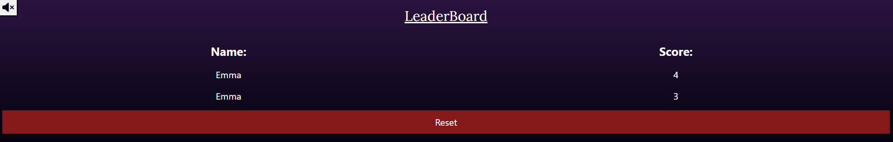

# Testing

> [!NOTE]
> Return back to the [README.md](README.md) file.

## Code Validation

### HTML

I have used the recommended [HTML W3C Validator](https://validator.w3.org) to validate all of my HTML files.

| Directory | File | URL | Screenshot | Notes |
| --- | --- | --- | --- | --- |
|  | [404.html](https://github.com/twitch10126/memorise-this/blob/main/404.html) | [HTML Validator](https://validator.w3.org/nu/?doc=https://twitch10126.github.io/memorise-this/404.html) |  | No errors found |
|  | [index.html](https://github.com/twitch10126/memorise-this/blob/main/index.html) | [HTML Validator](https://validator.w3.org/nu/?doc=https://twitch10126.github.io/memorise-this/index.html) |  | No errors found |


### CSS

I have used the recommended [CSS Jigsaw Validator](https://jigsaw.w3.org/css-validator) to validate all of my CSS files.

| Directory | File | URL | Screenshot | Notes |
| --- | --- | --- | --- | --- |
| assets | [style.css](https://github.com/twitch10126/memorise-this/blob/main/assets/css/style.css) | [CSS Validator](https://jigsaw.w3.org/css-validator/validator?uri=https://twitch10126.github.io/memorise-this) |  | No errors found |


### JavaScript

I have used the recommended [JShint Validator](https://jshint.com) to validate all of my JS files.

| Directory | File | URL | Screenshot | Notes |
| --- | --- | --- | --- | --- |
| scripts | [404.js](https://github.com/twitch10126/memorise-this/blob/main/scripts/js/404.js) | N/A |  | No errors found |
| scripts | [script.js](https://github.com/twitch10126/memorise-this/blob/main/scripts/js/script.js) | N/A |  | No errors found |


## Responsiveness

I've tested my deployed project to check for responsiveness issues.

| Page | Mobile | Tablet | Desktop | Notes |
| --- | --- | --- | --- | --- |
| Home |  |  |  | Works as expected |
| Game |  |  |  | Works as expected |
| 404 |  |  |  | Works as expected |

## Browser Compatibility

I've tested my deployed project on multiple browsers to check for compatibility issues.

| Page | Chrome | Firefox | Edge | Notes |
| --- | --- | --- | --- | --- |
| Home |  |  |  | Works as expected |
| Game |  |  |  | Works as expected |
| 404 |  |  |  | Works as expected |

## Lighthouse Audit

I've tested my deployed project using the Lighthouse Audit tool to check for any major issues. Some warnings are outside of my control, and mobile results tend to be lower than desktop.

| Page | Mobile | Desktop |
| --- | --- | --- |
| Home |  |  |
| 404 |  |  |

## Defensive Programming

Defensive programming was manually tested with the below user acceptance testing:

| Page/Feature | Expectation | Test | Result | Screenshot |
| --- | --- | --- | --- | --- |
| Button Press | Only valid game buttons should be clickable | Click outside game buttons | Game ignores invalid clicks. |  |
| | Coloured buttons (red, blue, green, purple) should only be clickable once the game has started | Clicked the game buttons before the start button was pressed,   | Coloured buttons are disabled before start button is pressed. |  |
| | Coloured buttons (red, blue, green, purple) should only be clickable when the start audio has ended. | Click game buttons while the start audio is playing | Buttons are disabled during start audio. |  |
| | Coloured buttons (red, blue, green, purple) should not be clickable during the AI's turn. | Click the coloured buttons while the AI sequence is playing | Buttons are disabled during AI turn. |  |
| | Reset button should reset local storage. | Update leaderboard with some scores then click reset. | Leaderboard reset as expect to default "player" "Score". |  |
| | Restart button should reset the game to its initial state. |Start a game, get a score, click restart. | Game reset to it's initial state. | |
| Social Media Icons | Social media Links should open to the correct pages in a new tab. | Click each link to verify its path | Links work as expected |  |
| Sequence Tracking | Game should only proceed if user input matches the correct sequence | Enter wrong sequence. | Game ends, save modal appears. |  |
| Name input | Input field of modal should require a name to save score, otherwise it throws an error. | Try to submit with no name added to input field. | A error is thrown ("please enter a valid name") |  |
| Round Tracker | Feature is expected to track the current round a user is on. | Play multiple game to ensure round count is increasing. | Round updated as expected. |  |
| 404 Error Page | Feature is expected to display a 404 error page for non-existent pages. | Navigated to an invalid URL (e.g., `/test`) to test error handling. | A custom 404 error page was displayed as expected. |  |
| | Page is expected to redirect the user back to index.html after 5 seconds. | Navigated to an invalid URL (e.g., `/test`). | The countdown appeard and i was navigated back to index.html once the countdown had finished. |  |

## User Story Testing

| Target | Expectation | Outcome | Screenshot |
| --- | --- | --- | --- |
| As a player | I want to see a clear start button on the screen | so that I can begin the game. |  |
| As a player |  I want to understand the rules of the game before starting | so that I know how to play. |  |
| As a player | I want the game to display a sequence of coloured lights | so that I can memorize and repeat it. |  |
| As a player |  I want to press the correct sequence of coloured buttons | so that I can advance to the next round. |  |
| As a player |  I want the sequence to increase in difficulty as I progress | so that the game remains challenging. |  |
| As a player | I want the game to provide instant feedback when I press a button | so that I know if my input was correct or incorrect. |  |
| As a player | I want the game to show my score after each round | so that I can track my progress. |  |
| As a player | I want the option to restart the game after losing | so that I can try again. |  |
| As a player | I want my highest score to be saved | so that I can challenge myself to beat it. |  |

## Automated Testing

I have conducted a series of automated tests on my application.

> [!NOTE]
> I fully acknowledge and understand that, in a real-world scenario, an extensive set of additional tests would be more comprehensive.

### JavaScript (Jest Testing)

I have used the [Jest](https://jestjs.io) JavaScript testing framework to test the application functionality. In order to work with Jest, I first had to initialize NPM.

- `npm init`
- Hit `<enter>` for all options, except for **test command:**, just type `jest`.

Add Jest to a list called **Dev Dependencies** in a dev environment:

- `npm install --save-dev jest`

**IMPORTANT**: Initial configurations

When creating test files, the name of the file needs to be `file-name.test.js` in order for Jest to properly work. Without the following, Jest won't properly run the tests:

- `npm install -D jest-environment-jsdom`

Due to a change in Jest's default configuration, you'll need to add the following code to the top of the `.test.js` file:

```js
/**
 * @jest-environment jsdom
 */

const { test, expect } = require("@jest/globals");
const { function1, function2, function3, etc. } = require("../script-name");

beforeAll(() => {
    let fs = require("fs");
    let fileContents = fs.readFileSync("index.html", "utf-8");
    document.open();
    document.write(fileContents);
    document.close();
});
```

Remember to adjust the `fs.readFileSync()` to the specific file you'd like you test. The example above is testing the `index.html` file.

Finally, at the bottom of the script file where your primary scripts are written, include the following at the very bottom of the file. Make sure to include the name of all of your functions that are being tested in the `.test.js` file.

```js
if (typeof module !== "undefined") module.exports = {
    function1, function2, function3, etc.
};
```

Now that these steps have been undertaken, further tests can be written, and be expected to fail initially. Write JS code that can get the tests to pass as part of the Red-Green refactor process. Once ready, to run the tests, use this command:

- `npm test`

**NOTE**: To obtain a coverage report, use the following command:

- `npm test --coverage`

Below are the results from the tests that I've written for this application:

| Test Suites | Tests | Screenshot |
| --- | --- | --- |
| 1 passed | 13 passed |  |

#### Jest Test Issues

## Bugs

### Fixed Bugs

[](https://www.github.com/twitch10126/memorise-this/issues?q=is%3Aissue+is%3Aclosed+label%3Abug)

I've used [GitHub Issues](https://www.github.com/twitch10126/memorise-this/issues) to track and manage bugs and issues during the development stages of my project.

All previously closed/fixed bugs can be tracked [here](https://www.github.com/twitch10126/memorise-this/issues?q=is%3Aissue+is%3Aclosed+label%3Abug).


### Unfixed Bugs

[](https://www.github.com/twitch10126/memorise-this/issues)

Any remaining open issues can be tracked [here](https://www.github.com/twitch10126/memorise-this/issues).


### Known Issues

| Issue | Screenshot |
| --- | --- |
| On devices smaller than 234px, the content in the center starts to hide behind the coloured buttons. |  |

> [!IMPORTANT]
> There are no remaining bugs that I am aware of, though, even after thorough testing, I cannot rule out the possibility.